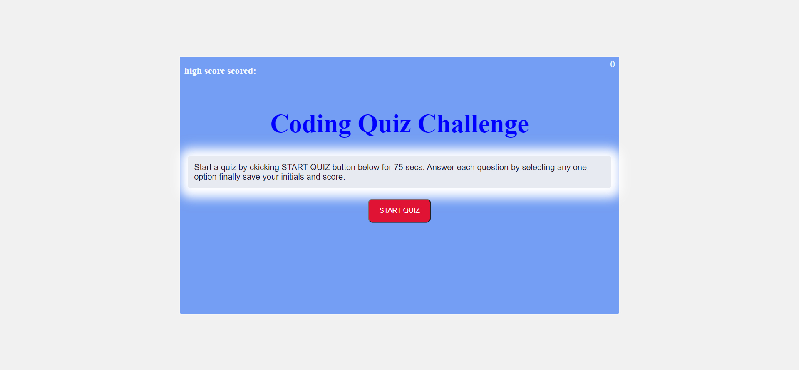

# Code Quiz 

  This is a quiz Game developed using HTML,CSS and Java Script.
  It is a timed coding quiz with multiple-choice questions. This app will run in the browser and will feature dynamically updated HTML and CSS powered by JavaScript code with a resposive user interface.

## User Story

```
AS A coding boot camp student
I WANT to take a timed quiz on JavaScript fundamentals that stores high scores
SO THAT I can gauge my progress compared to my peers
```

## Acceptance Criteria

```
GIVEN I am taking a code quiz
WHEN I click the start button
THEN a timer starts and I am presented with a question
WHEN I answer a question
THEN I am presented with another question
WHEN I answer a question incorrectly
THEN time is subtracted from the clock
WHEN all questions are answered or the timer reaches 0
THEN the game is over
WHEN the game is over
THEN I can save my initials and my score
```

## Mock-Up

The following animation demonstrates the application functionality:



## Build status
Issue with clear highscore button needs to be solved.Need a clear concept of stopPropagation method.

## Features
1.Implemented code to traverse thruogh parent element instead of traversing each child element 
```javascript
const getCheckAnswer=(e)=>{
    if(e.target !== e.currentTarget){
     var clickedItem=e.target.id;
     alert("hello"+clickedItem);
 }
}
```
## API reference
[get input value](https://www.tabnine.com/academy/javascript/get-value-of-input/)


[Position element]( https://www.w3schools.com/css/css_positioning.as)


[timeOut()](https://www.w3schools.com/jsref/tryit.asp?filename=tryjsref_win_settimeout_cleartimeout


## URL

[Deployed URL](https://programer122223.github.io/Quiz-game-repo/)

[github ](https://github.com/PROGRAMER122223/Quiz-game-repo.git)
